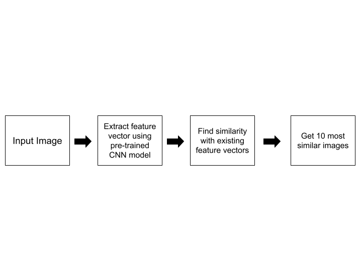

# Problem Statement: Finding Visually Similar Garments for an Input Garment
Garments in the fashion domain can be of multiple shapes, sizes, and colors. Finding garments similar to
each other is an important feature used by e-commerce websites to show recommendations to its users.
We would like to find visually similar garments for any input garment from within a given dataset of garment
images.

# Demo
https://user-images.githubusercontent.com/87168504/184480530-6899bc12-a4a2-4b65-bf1b-37f709981d65.mp4

# Architecture

# Dataset
https://drive.google.com/file/d/1OCvfi5L_znC3xGGyH_hXEYEKSGcRleHU/view?usp=sharing

# How to use this repo
- **Step1:** `git clone https://github.com/sayansaha934/Garments-Recommendation-System.git`
- **Step2:** Change directory to `Garments-Recommendation-System`
- **Step3:** Download the dataset and store all images in  `static/database`
- **Step4:** Create a virtual env `conda create -n Garments-Recommendation-System python==3.6.9`
- **Step5:** `conda activate Garments-Recommendation-System`
- **Step6:** Install requirements `pip install -r requirements.txt`
- **Step7:** Run `store_features.py`
- **Step8:** Run `app.py`
